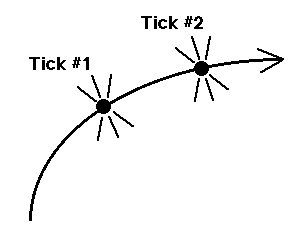

# Introduction to Speeding

## Special relativity describes the very fast.

General relativity (the Theory of Gravitation) describes matter and motion near massive objects (stars, galaxies, blackholes, etc.) and the universe as a whole.

## Wristwatch time
First we need to understand wristwatch time. Imagine a wristwatch attached to a stone which is thrown. The stone follows Newton's First Law. There are two points at which the wristwatch ticks. We measure the distance (s) and time (t) between these two ticks in a particular free-float or inertial reference frame.

NOTE: special relativity warns us that a different observer passing us in uniform relative motion typically records a different value of spacial separation () and time lapse () between ticks.

All inertial observers, regardless of their state of relative motion and values of  and  agree on the value of time  between ticks as 

The metric tells us the separation between events in spacetime.

We call  the wristwatch time and it can be used to describe the separation between any pair of events for which  is greater than .

For simplicity, the units of space and time are the same (i.e. light years and years). The speed of light () is the conversion factor between measures of space and time. Wristwatch time () is an invariant, because it is constant for all observers.

Speed depends on the reference frame, in this case  (units cancel out) so velocity is a fraction of the speed of light (unitless).

## Proper distance
If two events occur simultaneously, we cannot use wristwatch time. Simultaneous events are therefore useless for measuring time but perfect for measuring length.

To find a rod's length we can set off explosions at each end at  and  would be our distance. BUT special relativity warns us that a different observer passing in uniform relative motion typically would not agree that both explosions occurred at . However, all initial observers agree in the distance: .

 is called the proper distance and it describes the separation between  any pair of events for which  is greater than . Again, units of space and time are the same. The proper length is therefore the length of a rod as measured in a rest frame.

## The Principles of Extreme Aging
Flat Spacetime is the arena of the free float frame in which special relativity correctly describes motion.

The Twin Paradox predicts the motion of a free particle. If one twin stays on earth and the other travels to a distant star and returns, when they are reunited they will no longer be identical. We call being at rest "natural" -- the motion of the traveling twin is forced, not natural. BUT viewed from a second relatively moving free-float frame, the twin on earth moves with constant speed in a straight line which is also natural motion. In any such frame the time lapse on the wristwatch of the earth twin can be calculated from the metric.

The natural motion of a free object between two events in flat spacetime is the one for which the wristwatch worn by the object has an extremal (maximum or minimum) time reading between those two events.

PRINCIPLE OF EXTREMAL AGING: The path of a free object takes between two events in spacetime is the path for which the time lapse between these events, recorded in the object's wristwatch is an extremum. This works for general relativity too!

## Energy in Special Relativity
Suppose, like our wristwatch example, we have a stone following its natural path and emitting three flashes. All three flashes are fixed in space and the first and third flashed are fixed in time. Let the wristwatch time between flash 1 and flash 2 be  and the wristwatch time between flash 2 and flash 3 be . We want to adjust the time of the middle flash so that the writwatch time from flash 1 to flash 3 is an extremum. Then outcome will be a conserved quantity: energy...

Let the distance from flash 1 to flash 2 be  and the time between flash 1 and flash 2 be ;. Then we can write . Taking the derivative we get .

Let  be the time between flash 1 and flash 3 and  be the corresponding distance. Then we can write a similar expression for the wristwatch time between the second and third flashes . Taking the derivative we get .

Let the total wristwatch time from flash 1 to flash 3 be . Then we know .

When will the stone emit #2? By the Principle of Extremal Aging: time  will be such that the aging is an extremum so we set the derivative of  with respect to  equal to 0.

We can rewrite the equation as follows:

 if we let   (the time between flash 1 and flash 2) and  (the time between flash 2 and flash 3).

But locations A and B were chosen arbitrarily so it holds for all pairs of adjacent segments placed anywhere along the path.

 a constant of motion

 where m is the mass of the particle.

for  and  then

.

## Momentum in Special Relativity
To derive motion we repeat the same process but assume the time   of the second flash is fixed but the position  is not. We get:

.

This gives the momentum per unit mass for a particle moving with constant speed.

## Mass in Special Relativity

 where conv refers to conventional units. These are important results in special relativity.
