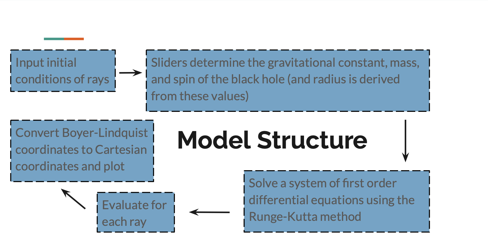

Here's a brief overview of the two models being implemented in this repository. For more information feel free to visit the repository and check out the code!

## Kerr Model

In this model the user can input the number of rays which appear in a matrix from a single starting point (the position of which can also be manually changed in the program). The sliders determine the gravitation, mass and spin of the black hole. For each ray we solve a system of first order differential equations using the Runge-Kutta method which returns coordinates in Boyer-Lindquist form (a metric used to standardize measurements of time and distance in Kerr spacetime from all reference frames) that we can clean and convert to Cartesian coordinates. Then we use MATLAB’s plot3() function to generate the final plot.

## Schwarzschild Model

Initially my plan was to start with the Schwarzschild equation, derive Christoffel symbols to generate the geodesic equation, and integrate it for each pixel. However, this is a massive computation that’s not even remotely feasible to perform. This is especially true since the model is meant to be dynamic -- we’re not generating a plot for one time use, we want to be able to input values and easily regenerate the visualization. The slow speed of the program is one of the biggest obstacles/ places where there’s a constant need to try to optimize.

Instead we can perform a change of coordinates and simplify the equation, thereby generating a second order equation that’s *much* simpler.

We implement this fix and then numerically integrate the differential equation. The output is a full set of ray light paths. Then we write a script that queries these outputted paths and looks for the zeroes, which correspond to the asymptotes of scattering orbits and their angles which tells us about the final direction of the ray. Finally we can use this deflection angle and use vector algebra to generate the full light path (in plottable coordinates)
